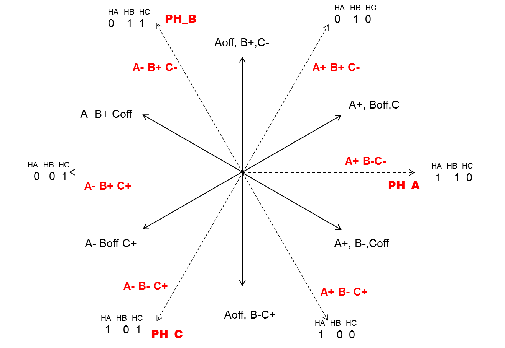
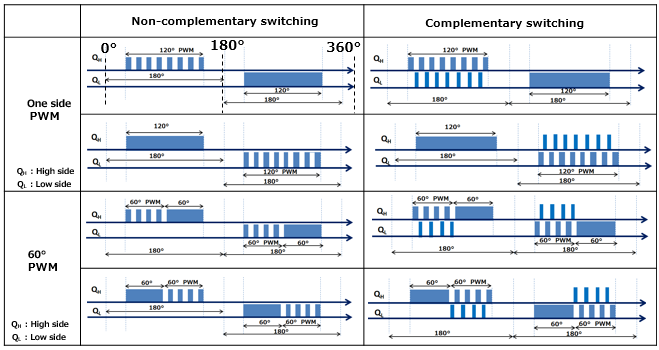

# Hall Sensor BLDC

## Commutation table

Below shows the commutation sequence of a motor, assuming Hall sensors placed 120° electrically apart. Refer to the [TI blog post](https://e2e.ti.com/blogs_/b/industrial_strength/posts/generate-your-own-commutation-table-part-2) to generate your own commutation sequence.

To rotate in the positive and negative direction, the commutation table is
<table>
<thead>
  <tr>
    <th rowspan="2">Hall ABC</th>
    <th colspan="3">Positive direction</th>
    <th colspan="3">Negative direction</th>
  </tr>
  <tr>
    <th>Phase A</th>
    <th>Phase B</th>
    <th>Phase C</th>
    <th>Phase A</th>
    <th>Phase B</th>
    <th>Phase C</th>
  </tr>
</thead>
<tbody>
  <tr>
    <td>001</td>
    <td>off</td>
    <td>+</td>
    <td>-</td>
    <td>off</td>
    <td>-</td>
    <td>+</td>
  </tr>
  <tr>
    <td>011</td>
    <td>+</td>
    <td>off</td>
    <td>-</td>
    <td>-</td>
    <td>off</td>
    <td>+</td>
  </tr>
  <tr>
    <td>010</td>
    <td>+</td>
    <td>-</td>
    <td>off</td>
    <td>-</td>
    <td>+</td>
    <td>off</td>
  </tr>
  <tr>
    <td>110</td>
    <td>off</td>
    <td>-</td>
    <td>+</td>
    <td>off</td>
    <td>+</td>
    <td>-</td>
  </tr>
  <tr>
    <td>100</td>
    <td>-</td>
    <td>off</td>
    <td>+</td>
    <td>+</td>
    <td>off</td>
    <td>-</td>
  </tr>
  <tr>
    <td>101</td>
    <td>-</td>
    <td>+</td>
    <td>off</td>
    <td>+</td>
    <td>-</td>
    <td>off</td>
  </tr>
</tbody>
</table>

## PWM mode

Below shows the different PWM modes. Switching can happen at the high side, low side, front 60°, back 60°. For complementary switching, there exists a dead time between switching off high side and switching on low side.

## STM32 implementation

Two timers are in play, one interfacing with the Hall sensors, another generating PWM outputs to drive the motor phases.
The three Hall sensors are connected to the XOR input of the first timer. On every Hall sensor switching, the timer count is captured onto channel 1, which can be used to calculate the speed of the motor. A `CC1` interrupt is also generated. In the interrupt, the current position is determined from the voltage levels of the Hall sensors. The `CCxE`, `CCxNE`, `OCxM` bits of the PWM timer are preloaded according to *current* position, and are immediately updated by generating a `COM` event. The bits are then preloaded with the *next* position according to the direction and the commutation table. The `CC1` signal of the first timer is set as trigger output, connecting to the trigger input of the PWM timer, causing the preloaded bits to be updated as Hall sensor switching happens. Writing the current position before preloading the next position ensures the motor to be able to start from stationary and properly switch directions. PWM timer output is enabled by setting the `MOE` bit.
